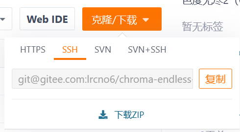
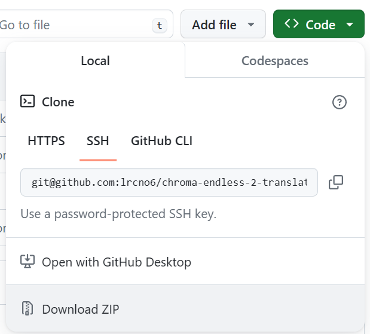
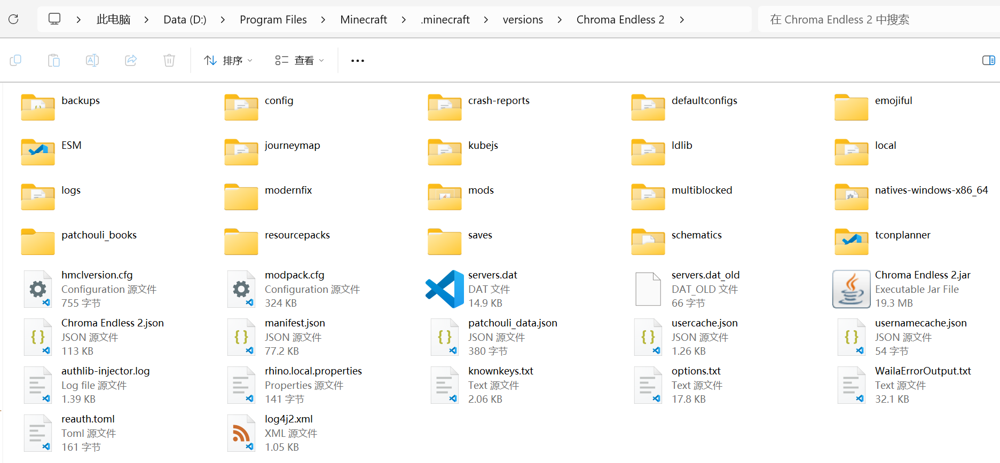

# Chroma Endless 2 zh_cn Translation

整合包网址：https://www.curseforge.com/minecraft/modpacks/chroma-endless-2

当前整合包版本：1.0.8

巧工魔艺（MNA）汉化使用了mcmod社区下载的汉化（QQ酱740777、清秋）

注：资源包名字有改动，更新汉化时可能需要将之前的资源包删除。

进度：

- [x] 改名物品汉化
- [x] KubeJS 新增物品汉化
- [ ] FTB 任务
	- [x] 前言
		- [x] 欢迎
		- [x] 商店
		- [x] 挑战
		- [x] 实用物品
	- [x] 主线流程
		- [x] 第1章
		- [x] 第2章
		- [x] 第3章
		- [x] 第4章
		- [x] 第5章
		- [x] 第6章
		- [x] 第7章
		- [x] 最终章
	- [ ] 支线任务
		- [x] 沉浸工程重型机器
		- [x] Powah
		- [x] 热力系列
		- [x] 禁忌与奥秘
		- [x] 通用机械
		- [x] 元素周期表
		- [x] 深度怪物学习
		- [x] 深暗之园
		- [ ] 大型反应堆
		- [ ] 千面厨房
		- [ ] 应用能源
		- [ ] 蔚蓝浩空
		- [ ] 邪恶工艺
		- [ ] 巧工魔艺
		- [ ] 神秘农业
		- [ ] 神化
		- [ ] Spirit
- [x] 思索

欢迎大家来贡献翻译，指正错误，提出建议等

---

## 汉化安装教学

首先需要自行下载[I18N汉化模组](https://www.modrinth.com/mod/i18nupdatemod/versions)。

再在GitHub/Gitee界面点击克隆/下载（Code），再点击下载ZIP（Download ZIP）下载ZIP文件。

下载完成后解压到你的整合包目录下：

最后，进入游戏启用CE2-l10n、mna-l10n和i18n-patch三个资源包。